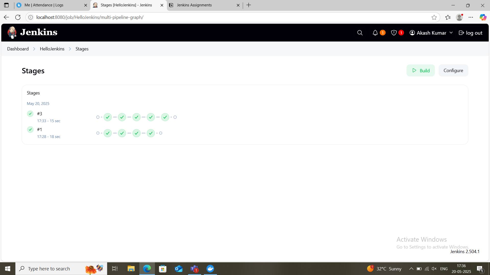

Screenshot of Jenkins dashboard 

stageview1 

stageview2 

Screenshot of pipeline's successful execution (Stage View)  

Screenshot of the console output  

I learned how we can use the Build History to track previous executions   
Also, I learned how to leverage the Stage View for real-time visualization of the pipeline's progress. 
The Console Output provided key insights into the build process, enabling me to monitor logs and identify any issues. 
I learned that these tools allow us to do efficient pipeline management and troubleshooting. 
